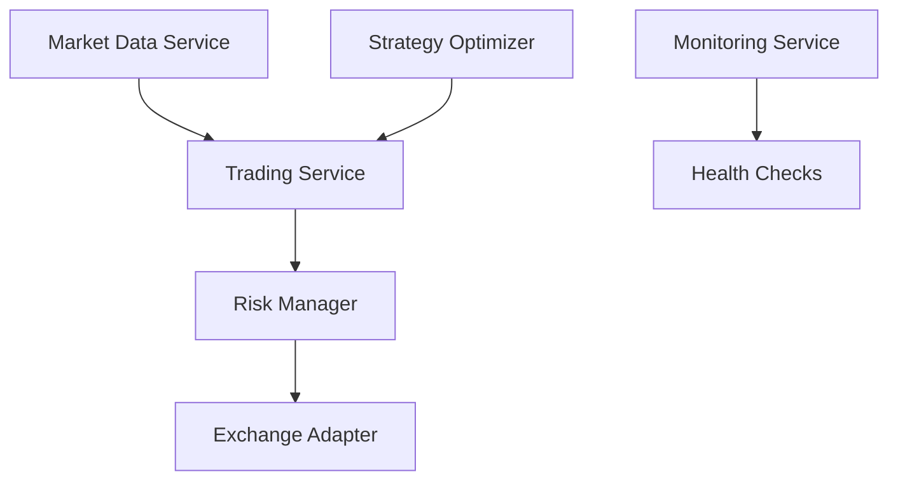

# Architecture Overview

## System Architecture

The Trading System follows a modular, service-oriented architecture designed for reliability, scalability, and maintainability.

## Core Components

### 1. Trading System Coordinator
The `TradingSystemCoordinator` serves as the central orchestrator, managing:
- Trading execution flow
- System state coordination
- Component lifecycle management

### 2. Market Data Processing
- Real-time market data ingestion
- Data caching and optimization
- Multiple exchange support

### 3. Trading Strategy Engine
- Strategy implementation and execution
- Backtesting capabilities
- Theory-based and technical analysis approaches

### 4. Risk Management
Components:
- `RiskManager`: Real-time risk assessment
- `RiskValidationService`: Trade validation
- Configurable risk parameters

### 5. Exchange Integration
Supported exchanges:
- TradingView integration
- Tradovate connectivity
- Simulated exchange for testing

### 6. Monitoring and Health Checks
Comprehensive monitoring system:
- Component health monitoring
- Performance metrics
- Alert management
- Grafana dashboards
- Prometheus integration

## Data Flow

## Technology Stack

- **Framework**: .NET Core
- **Data Storage**: Entity Framework Core
- **Monitoring**: Prometheus & Grafana
- **Configuration**: JSON-based settings
- **Containerization**: Docker support

## Design Patterns

The system implements several key design patterns:

1. **Repository Pattern**
   - Abstracted data access
   - Clean separation of concerns

2. **Factory Pattern**
   - Component instantiation
   - Configuration management

3. **Strategy Pattern**
   - Pluggable trading strategies
   - Flexible algorithm implementation

4. **Observer Pattern**
   - Event-driven architecture
   - Real-time updates

## Security

- Secure configuration management
- Authentication for monitoring endpoints
- Rate limiting
- Audit logging

## Scalability

The system is designed for horizontal scalability:
- Containerized deployment
- Stateless services
- Cache optimization
- Async operations

## Configuration Management

Configuration is managed through:
- Environment-specific JSON files
- Docker environment variables
- Runtime configuration updates
